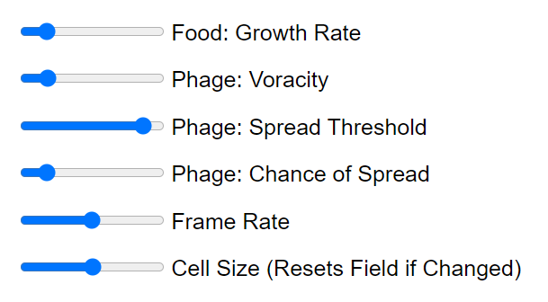

# Micro Automata

## Description
**NB**: This project is built on the p5.js framework. See `Technology` below for links.

To experiment live, see: [Micro Automata on p5.js](https://editor.p5js.org/mkrauklis/sketches/8rOq0sw2F)

This project aims to extend upon the ideas of [Conway's Game of Life](https://en.wikipedia.org/wiki/Conway%27s_Game_of_Life) by creating a simulation much closer to true microbial life. The simulation allows for 4 cell types: food (green), bacteria (blue), and viral phages that attack the bacteria (red). I implemented a preliminary version of this concept in 2012 on Android; see: [MicroLife](https://github.com/mkrauklis/MicroLife). This implementation is a from-the-ground-up-port to JS as to make it available in the browser. It also incorporates several new concepts:
* Neural Networks - Bacteria operate on a neural net that takes inputs (avalable food, current health, if it's infected by a phage, how many neighboring bacteria there are, and how many of those neighbors are infected by phages) and generates behavioral outputs (eating rate, cost of reproduction and health of offspring {costlier reproduction produces healthier offspring}, and if the bacteria should kill neighbors to reproduce).
  * The neural nets are randomly structured with between 3 and 7 layers, each hidden layer having between 3 and 10 neurons.
  * All produced neural networks are fully connected (FCNN) and do not have any convolutions nor recurance.
  * The neural network was implemented using object oriented concepts (rather than a matrix approach) purposefully, trading performance for ease of understanding.
  * Mutation - The neural networks have some chance of mutation which will effect the weights, biases, and mutation chance for the individual cell. This changes the behavior of the bacterial cell in random ways: some positive, some detrimental.
  * Lineage Tracking - With each mutation a new bacterial lineage is created. This can be visualized by hovering over "Bacteria Species" which highlights all mutated cells with yellow, hovering over the ID of the bacteria which will color all original lineage with green and all mutations of that originating lineage in red, by mousing over the grid and inspecting the visualization of the neural net, or by inspecting the plotly-generated lineage chart. Examples are demonstrated below.
* Seasons - The rate at which the food grows varies "seasonally," peaking mid-summer and bottoming-out mid-winter.

# UI Features
## The Growing Field
The growing field defaults to a pure green, denoting abundant food. The colors of each cell in the field correspond to the levels of each corresponding state.
* Green - Food
* Blue - Bacteria
* Yellow - Phage
* Black - Wall

Walls cannot be traversed by bacteria nor phage, however a diagional gap can potentially leak if a bacteria or phage reproduces through the gap.

*Field Full of Food*

*Field With Bacteria*

*Field With Bacteria and Phage*

*Field With Walls Encapsulating Different Species*

## Seasons
The simulation will oscilate through sinoidal seasons centered around the `Food: Growth Rate` slider. Summer has the most abundant food while winter has the least.

## Drawing Type
Drawing types (food, bacteria, phage, wall, none) can be changed by mouse-scrolling or by clicking the `Update Drawing Type` button.

## Configuration Sliders
There are several sliders available to adjust some of the environmental parameters:
* Food: Growth Rate - How quickly food on a cell grows (even if there is bacteria present). Seasons will center around this value. The more food, the faster bacteria can grow and longer they can persist.
* Phage: Voracity - How quickly phages will consume resources from their bacterial host. The more voracious the more quickly they will reproduce, but alsot the more quickly they will kill their host.
* Phage: Chance of Spread - When a phage spreads how likely it is to infect each neighboring cell.
* Frame Rate: How quickly the simulation runs.
* Cell Size (Resets) - The size of each cell on the screen. The smaller the size, the more cells. More cells typically looks better but runs slower. Changing this value resets the simulation.

## Bacteria Info
This section shows how many mutations have occurred and metrics for each bacterial species, identified by ID. For each specias a count of how many bacteria are currently alive is shown. Mousing over `Bacteria Species:` will highlight all mutated cells in yellow. Mousing over an individual species will highlight it in green, will highlight any evolutionary relatives in red, and will show the bacterial neural net.

### Bacteria Neural Net Visualization
This visualization of the neural nets shows input neurons on the left and the output layer on the right. Weights (edges) and biases (nodes) are all on the scale of -1..1, visualized as -1==black and 1==almost-white.

As this creates output values in a quasi-Gaussian distribution centered around 0. The output values are expected to be in the range 0..1 with a non-trivial probability of reaching boundary values. To accomplish this the range is projected to the range -4.5..5.5 (a range of 10 centered around 0.5) and trimmed to 0..1. See: `NNNeuron.outputToZeroOneRange`.

## Bacterial Lineage Visualization

# Observations
## Evolutionary Pressure
### Seasons
Seasons introduce evolutionary pressure by changing the amount of food available to be consumed by the bacteria. Often bacterial species will simply die out during this period. Some go into hibernation. Some exhibit a ravenous sparse behavior, where they move quickly but don't reproduce in all directions as to consume as much food as possible while leaving a trail of wasteland behind them. In some circumstances a mutation introduces a variant in behavior that creates one of these behaviors, making the bacterial species more resilient than it previously was.

### Phage Infection
The introduction of a phage often places pressure on systems to exhibit new behavior. For example, a common pattern when pressured by a phage is to favor mutations that produce less-healthy offspring. Counterintuitively, this helps prevent the spread of a voracious phage as the weaker hosts die off before the phage can reproduce.

# Future Enhancements
* Neural Nets for the phages.
* Neural Nets for food.
* Ability to recognize relatives.
* UI enhancements.
* Make the visualization optional.
* Introduce a headless "tournament-style" mode.
* Develop characterizations framework (greedy, nice, neighborly, agressive).

# Technology
* [p5.js](https://p5js.org/)
* [jQuery](https://jquery.com/)
* [plotly](https://plotly.com/javascript/)